# Usage - ReKernelFlasher

## Table of Contents
- **1. Information Reading & Display (Home)**
- **2. Slots & Kernel Version Check**
- **3. Flashing Features**
- **4. Backup & Restore (with Important Notes)**
- **5. Toolbox Tools**
- **6. App Settings**

---

### 1. Information Reading & Display (Home)

After launching, the app automatically reads device information and displays it on the home screen, as shown below:

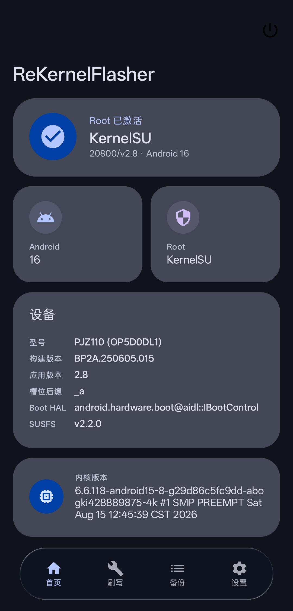

The home screen automatically reads the following information:

- `Device ROOT Manager`
- `Android Version`
- `Device Codename`
- `System Build Version`
- `Current Slot`
- `BootHAL`
- `SUSFS Version`
- `Kernel Version`

---

### 2. Slots & Kernel Version Check

Switch to the "Flashing" tab. If your phone supports A/B partitions, two slots will be shown here.

The info panel displays:

- Active status
- `Vendor_DLKM`
- `boot.img` / `init_boot.img` related information

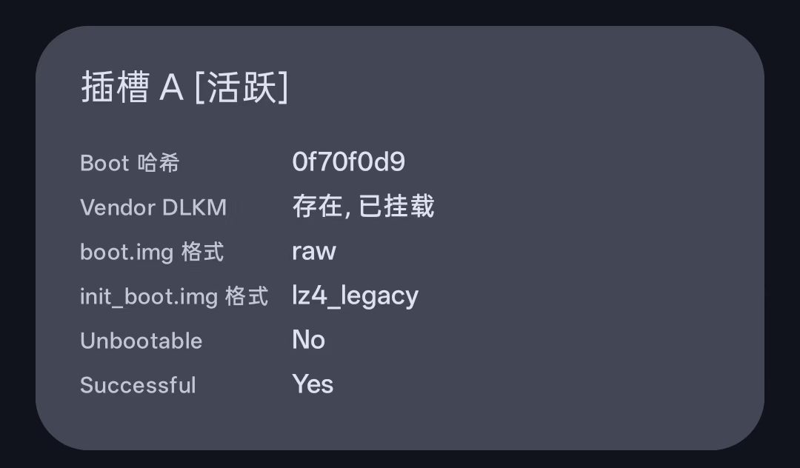

> **Tip**: Tapping the "Check Kernel Version" button re-scans and parses the current kernel version.

---

### 3. Flashing Features

On the "Flashing" page, tap the "Flash" button to enter the flashing page:

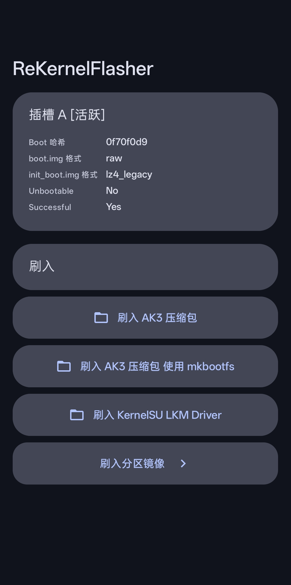

#### 3.1 Flash AK3

1. **Local flash**: Tap the "Flash AK3" button, select your AnyKernel3 zip, and a confirmation dialog will pop up. Tap confirm to start flashing.

   

   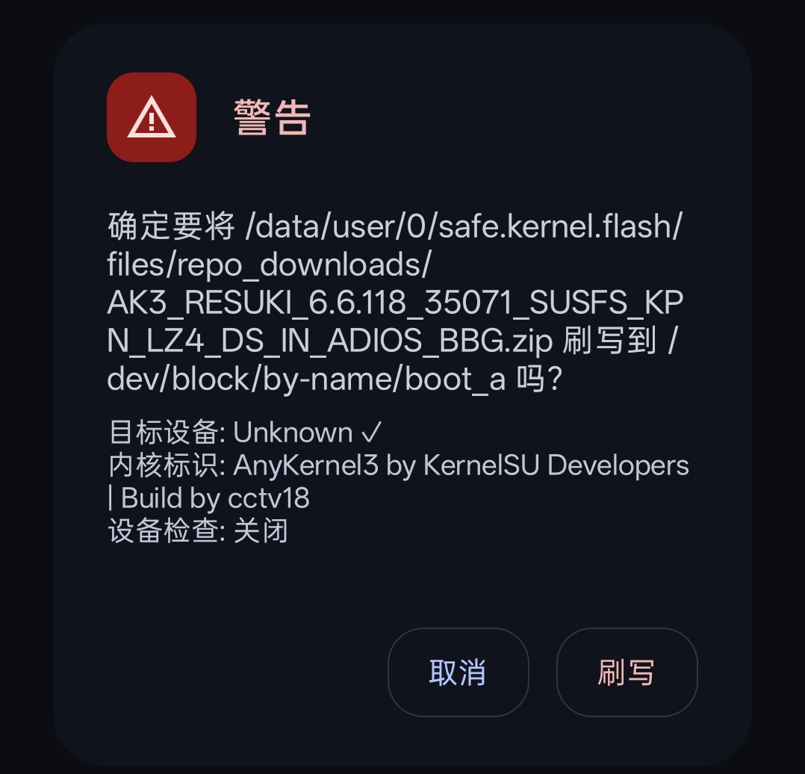

2. **Cloud G(O)KI flash**: Go back to the flashing page, tap the cloud icon in the top-right corner to enter the Cloud G(O)KI repository, select the package you want, then tap "Download" in the bottom-right corner. After the download completes, you will be asked whether to flash automatically — tap confirm to finish.

   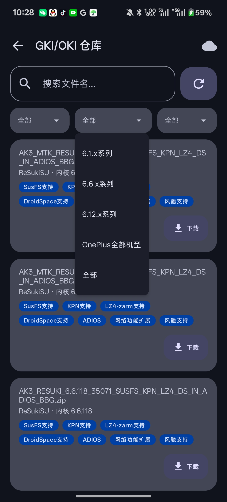

3. **Special note**: You can fully trust the content downloaded from Cloud G(O)KI. However, we strongly recommend enabling the "Auto Backup" switch in Settings, so that if you encounter issues after booting (such as screen flickering, display abnormalities, etc.), you can quickly roll back your snapshot backup. For details, see the "Important Notes" section under "4. Backup & Restore (with Important Notes)".

4. **Important note**: When flashing AK3, prefer the "Flash AK3" option. Only consider "Flash AK3 Zip (mkbootfs)" if problems occur. This option is planned to be deprecated starting from v3.0 (30000).

5. **About "Flash KernelSU LKM Driver"**: This feature is inherited from the upstream [KernelFlasher](https://github.com/fatalcoder524/KernelFlasher) and is not recommended because it may cause problems. It is planned to be deprecated in v2.9 (20900).

6. **Flash partition image**: After entering, you can see the preset partitions we provide: `boot`, `dtbo`, `init_boot`, `recovery`, `system_dlkm`, `vbmeta`, `vendor_boot`. Tap the partition you want to flash, select the corresponding `*.img` / `*.bin` file, and a confirmation dialog will pop up. Tap confirm to continue flashing.

   

---

### 4. Backup & Restore (with Important Notes)

#### 4.1 Backup & Restore

Tap the "Backup" button to enter the backup page. We provide the following preset partitions for your selection:

`boot`, `dtbo`, `init_boot`, `recovery`, `system_dlkm`, `vbmeta`, `vendor_boot`, `vendor_dlkm`

After selecting the partitions you want to back up, tap the "Backup Selected Partitions" button to start. Once the backup is done, you can return to the home screen and tap the "Backups" item in the bottom bar to view your backups.

> **Note**: To restore a backup, go to the flashing page, tap the "Restore" button, and restore the backup for the corresponding slot.

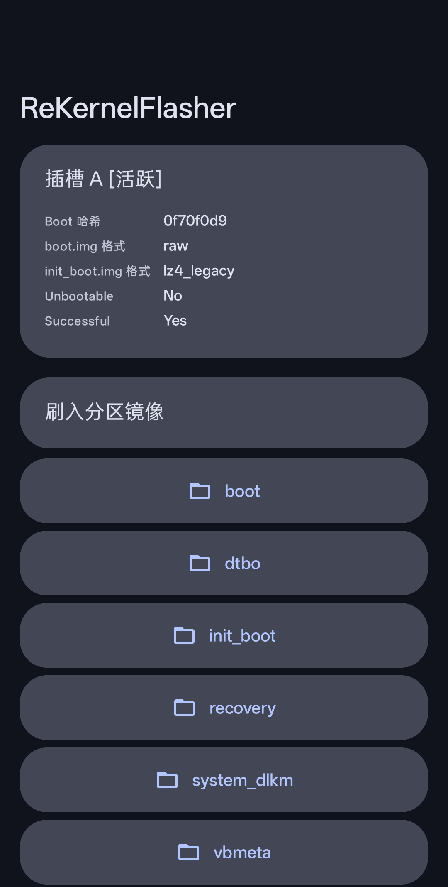

#### 4.2 Important Notes

We strongly recommend enabling "Auto Backup" as insurance, so that if problems occur after flashing, you can restore from the backup. AK3 supports one-tap rollback, which can be triggered from "Operation History" and "Backups".

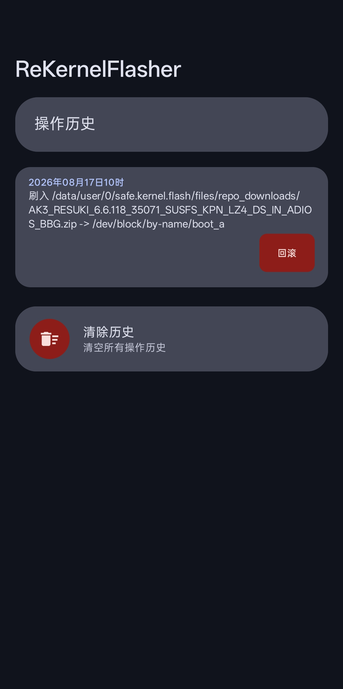

---

### 5. Toolbox Tools

Go to the "Settings" page and tap "Toolbox" to enter it. It contains the following useful tools:

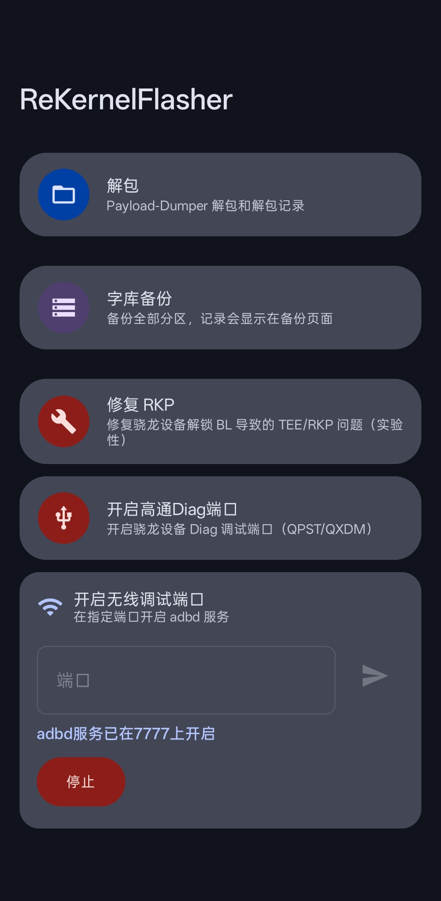

#### 5.1 Unpack (Payload-Dumper)

Used to extract `.img` partition files from an OTA `payload.bin`.

- **Unpack**: Tap it, then select a `payload.bin` file. The app uses the built-in `payload-dumper-go` tool to extract the `.img` partition files.
- **Unpack records**: View the extracted `.img` files (default directory `/sdcard/ReKernelFlasher/img/`). Long-press a record to open it with the system file manager.

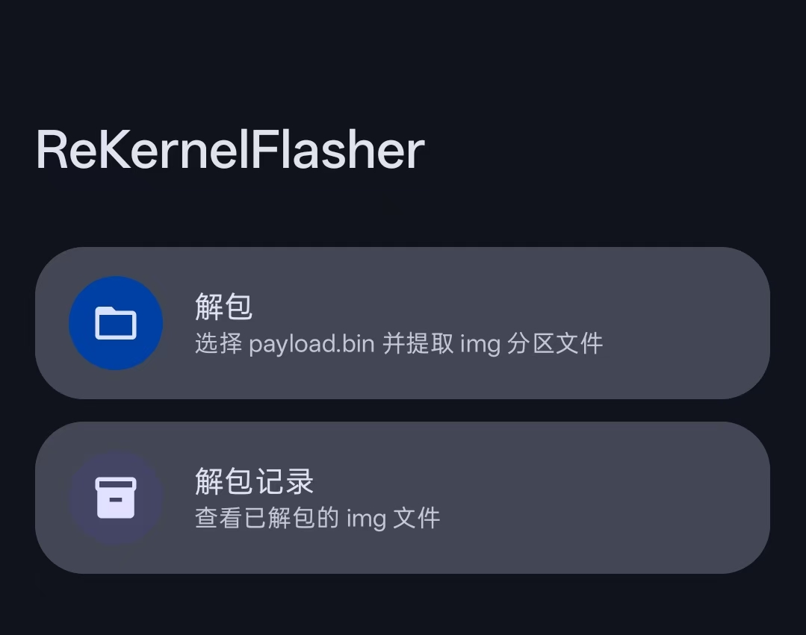

#### 5.2 Firmware Backup (Full Backup)

Used to back up all partitions except `userdata` and `sdc`. Backup records are shown on the "Backups" page.

- On entry, it automatically detects the platform, total partition count, skipped partitions, and estimated storage usage.
- Default backup directory: `/sdcard/ReKernelFlasher/backups/{model}字库备份`. Supports a custom directory and "Reset Directory".
- Tapping "Start Firmware Backup" shows a confirmation dialog. After confirming, the backup starts and shows success / skipped / failed counts when done.

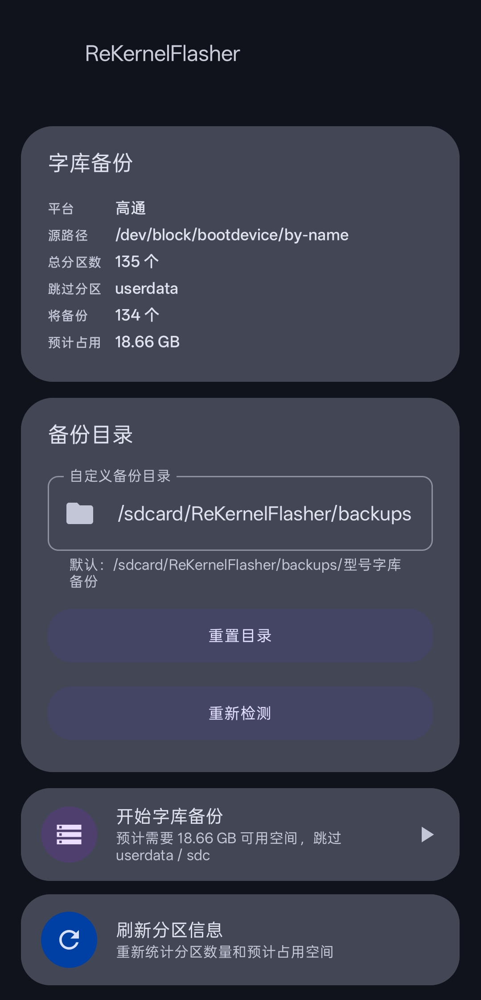

#### 5.3 Fix RKP (Experimental)

Used to fix TEE freeze and RKP-unavailable issues on Snapdragon (Qualcomm) devices caused by an unlocked bootloader.

- **Qualcomm platform only. Do NOT use on MediaTek devices!**
- Two fix options are provided:
  - "Qcom 8 Elite Gen5 (Beta)" — the new Snapdragon 8 Elite platform.
  - "Processor ≤ 8 Elite" — Snapdragon 8 Elite and below.
- Before running, it automatically backs up the `persist` partition (to `/sdcard/ReKernelFlasher/persist_backup/`) and outputs full logs (to `/sdcard/ReKernelFlasher/persist_backup/rkp_fix_*.log`).

> **Warning**: This feature is experimental, for trial only, and may cause device issues. If problems occur, do not file related issues.

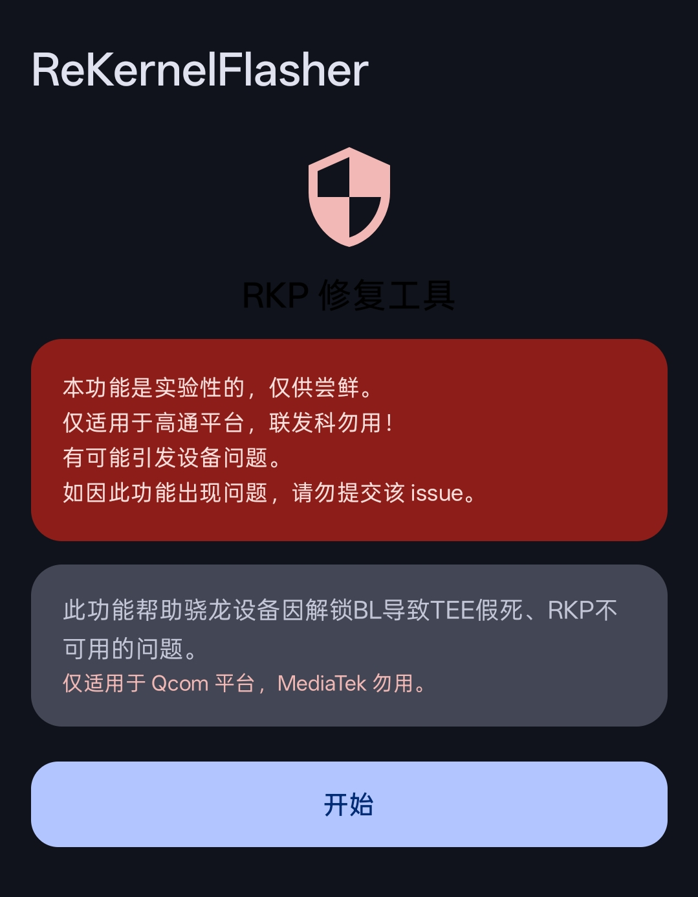
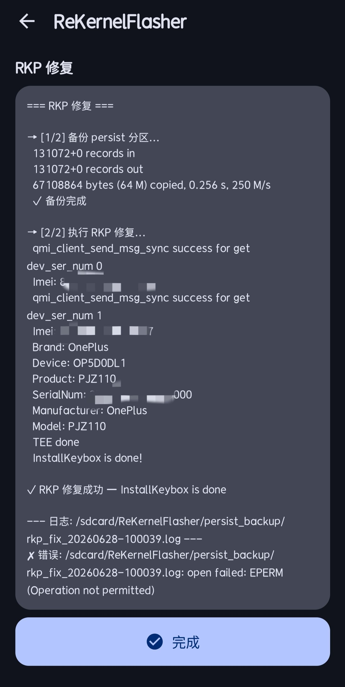

#### 5.4 Enable Qualcomm Diag Port

Used to enable the Diag debug port on Qualcomm devices for tools such as QPST / QXDM to connect.

- Internally enables the port via `setprop sys.usb.config diag,adb`.
- **Snapdragon devices only. Do NOT use on Dimensity (MediaTek) devices!**
- Make sure the phone is connected to a computer before enabling the port.

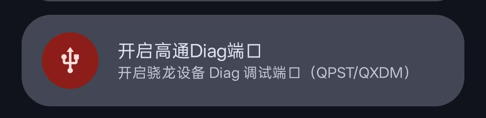

#### 5.5 Enable Wireless Debugging Port

Used to enable the `adbd` service (adb over TCP) on a specified port, so you can debug wirelessly from a computer via `adb connect`.

- Enter a port number (range `1024 – 65535`); the "paper plane" send button on the right only lights up when the port is valid.
- When the port is invalid, a red hint is shown below: `端口不合法，请输入1024-65535之间的数字`.
- Tapping send first checks the notification permission; if not granted, the system authorization is launched. After authorization, it runs `setprop service.adb.tcp.port {port} && stop adbd && start adbd`.
- If the port is already enabled, the app detects it automatically and skips opening it, showing the enabled state directly.
- After it is enabled: the notification bar shows a persistent notification (with a "Stop" button), the input field and send button become greyed out, and "adbd服务已在{port}上开启" is shown.
- Tapping the "Stop" button on the page or in the notification runs `setprop service.adb.tcp.port 0 && stop adbd && start adbd` to close the port and restore the UI.

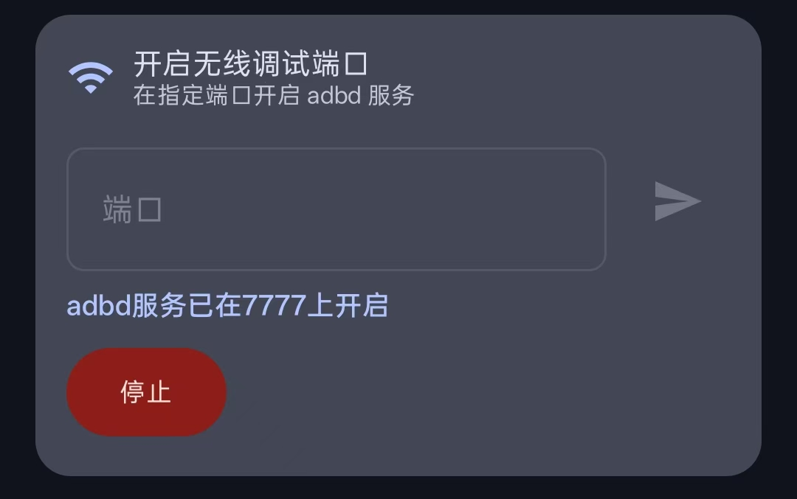

---

### 6. App Settings

The Settings page mainly includes: Check for Updates, Auto Backup Settings, Language Settings, Log Settings, Advanced Settings, and Toolbox. A few of them are described below.

#### 6.1 Save Logs (Log Settings)

Go to Settings → "Log Settings" to save the following logs to `/sdcard/Download/`:

- **Save ramoops**: Save the kernel panic / oops crash log (only shown when the device has ramoops).
- **Save dmesg**: Save the kernel ring buffer log.
- **Save logcat**: Save the Android system log.

#### 6.2 Advanced Settings

- **UI Scale (DPI)**: Drag the slider to adjust the UI scale (range `50% – 150%`). It takes effect after tapping "Apply", and only applies to the current session.

#### 6.3 Language Settings

Supports switching the app display language:

- 简体中文 (Simplified Chinese)
- 繁體中文（香港）(Traditional Chinese, Hong Kong)
- 繁體中文（台灣）(Traditional Chinese, Taiwan)
- English
